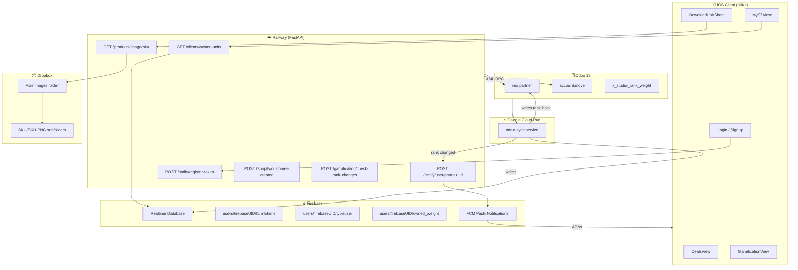

# MyEZ Integration Layer — Odoo + FastAPI + Firebase

FastAPI backend serving as the integration layer between Odoo ERP,
Firebase Realtime Database, and the MyEZ iOS client. Exposes REST
endpoints consumed by the mobile app, manages FCM push notifications,
triggers rank-up alerts via Google Cloud Run, and delivers Dropbox
product image links per SKU.

**Owner:** Javier Gomez — sole engineer, architect, and product owner.

---

## Live API

```
https://myez-odooapi-production.up.railway.app
```

---

## Stack

- **FastAPI** — REST API middleware layer
- **Odoo 19 XML-RPC** — ERP data source (res.partner, account.move)
- **Railway** — PaaS cloud deployment
- **Firebase Realtime Database** — user data, FCM tokens, owned units, deals
- **Firebase Auth** — end user authentication (email/password)
- **FCM v1** — iOS push notifications via APNs
- **Google Cloud Run** — bidirectional Odoo ↔ Firebase sync
- **Dropbox API** — OAuth2 scoped app for product image folder links
- **UIKit/iOS** — mobile client consuming this API

---

## Architecture



---

## Endpoints

| Method | Endpoint | Description |
|---|---|---|
| GET | `/ping` | Health check |
| GET | `/odoo/ping` | Odoo XML-RPC connection check |
| GET | `/clients/odoo` | Client list from Odoo |
| GET | `/clients/odoo/ranking` | Clients ranked by owned weight |
| GET | `/clients/owned-units/{partner_id}` | Owned units + weight + rank from Firebase |
| GET | `/products` | Published products from Odoo |
| GET | `/products/{product_id}` | Single product detail |
| GET | `/products/image/{sku}` | Dropbox shared folder URL for SKU |
| POST | `/shopify/customer-created` | Shopify webhook — new customer registration |
| POST | `/notify` | Push to specific FCM token |
| POST | `/notify/register-token` | Register device FCM token in Firebase |
| POST | `/notify/user/{partner_id}` | Push to all devices for a partner |
| POST | `/gamification/check-rank-changes` | Manual bulk rank check |

---

## Firebase Structure

```
users/
  {firebaseUID}/                    ← Firebase UID is the primary key
    uid: string                     — Firebase UID
    partner_id: int                 — res.partner ID from Odoo
    name: string
    email: string
    phone: string
    zipCode: string
    company_name: string
    profile_image_url: string
    owned_weight: int               — cumulative lbs owned
    typeuser: string                — rank tier name
    activeAt: int                   — Unix timestamp
    createdAt: string
    createdIn: string               — "shopify" | "my_ez" | "web_shop" | "sm_manual"
    subscribed: bool
    fcmTokens/
      {deviceKey}: string           — one entry per device (multi-device support)
    units/
      {SKU}/
        qty: int
        product_id: int

dealsLinks/
  {timestamp}/
    name, sort, imageURL, emoji, actionType, actionValue, expiresAt

rank_cache/
  {partner_id}: string             — rank tier name
```

---

## Rank Tiers

| Rank | Owned Weight | Discount |
|---|---|---|
| Minimumweight | 0 lb | 0% |
| Flyweight | 1,000 lb | 2% |
| Bantamweight | 2,000 lb | 3% |
| Featherweight | 4,000 lb | 4% |
| Lightweight | 6,000 lb | 5% |
| Middleweight | 9,000 lb | 6% |
| Heavyweight | 13,000+ lb | 7% |

- Rank is permanent — based on cumulative owned weight, never resets
- `typeuser` in Firebase stores the current rank name
- Tier promotion triggers push via `/notify/user/{partner_id}`
- Defined in `core/config.py` as `RANK_TIERS`

---

## Dropbox Integration

Images stored under `/MainImages (1)/{SKU}/{SKU}-PNG/` in team Dropbox.

`GET /products/image/{sku}`:
1. Authenticates via OAuth2 scoped Dropbox app
2. Auto-refreshes access token using `DROPBOX_REFRESH_TOKEN` when expired
3. Returns shared folder URL for `{SKU}-PNG`
4. iOS appends `dl=1` for direct download or `dl=0` to open in browser

---

## System Flow

```
iOS login → POST /notify/register-token → fcmTokens/{deviceKey} in Firebase

Shopify customer/create event
  → POST /shopify/customer-created
  → create res.partner + res.users in Odoo
  → write Firebase entry (createdIn: "shopify")

Odoo invoice confirmed (Phase 2)
  → Cloud Run odoo-sync
  → writes owned_weight + units to Firebase
  → writes rank back to res.partner
  → rank changed → POST /notify/user/{partner_id}
  → FCM v1 → APNs → iPhone
```

---

## Project Structure

```
myez-odoo-api/
├── main.py                   — mounts routers, health checks
├── core/
│   ├── config.py             — env vars, RANK_TIERS
│   └── helpers.py            — Odoo, Firebase, FCM, Dropbox utils
└── routers/
    ├── shopify.py            — POST /shopify/customer-created
    ├── clients.py            — GET /clients/*
    ├── products.py           — GET /products, /image/{sku}
    ├── notifications.py      — POST /notify, /register-token
    └── gamification.py       — POST /gamification/check-rank-changes
```

---

## Odoo Configuration

- **URL:** https://ezinflatables.odoo.com
- **DB:** devops-ghost-test-ezinflatables-main-14244209
- **Company ID:** 25 / **Portal Group ID:** 10
- **Portal user creation:** `"group_ids": [[6, 0, [10]]]` — Odoo 19 only
- Do NOT use: `groups_id`, `sel_groups_*`, `share: True` — broken in Odoo 19
- `mail.mail` send returns `None` — always wrap in try/except

---

## Environment Variables

| Variable | Purpose |
|---|---|
| `ODOO_URL` | Odoo instance URL |
| `ODOO_DB` | Odoo database name |
| `ODOO_USER` | Odoo admin user |
| `ODOO_PASSWORD` | Odoo admin password |
| `FIREBASE_SERVICE_ACCOUNT` | Base64-encoded service account JSON |
| `DROPBOX_TOKEN` | OAuth2 access token (auto-refreshed) |
| `DROPBOX_REFRESH_TOKEN` | OAuth2 refresh token |
| `DROPBOX_APP_KEY` | ....h3nbv |
| `DROPBOX_APP_SECRET` | Dropbox app secret |
| `SHOPIFY_WEBHOOK_SECRET` | HMAC-SHA256 webhook verification |
| `CACHE_BUST` | Increment to force Railway rebuild |

---

## Security

- All credentials in `.env` — never committed
- Railway env vars used in production
- Dropbox token auto-refreshed server-side — never exposed to iOS
- Shopify webhook verified via HMAC-SHA256 signature
- `.gitignore` excludes all secrets

---

## Local Setup

```bash
git clone https://github.com/javiergomezgit/myez-odoo-api
cd myez-odoo-api
cp .env.example .env  # add credentials
pip install -r requirements.txt
uvicorn main:app --reload
```

---

## Related Repos

| Repo | Description |
|---|---|
| github.com/javiergomezgit/MyEZ-App | iOS client |
| github.com/javiergomezgit/ezclock-api | EZClock internal app |

---

## Author

Javier Gomez — Senior Software Engineer
